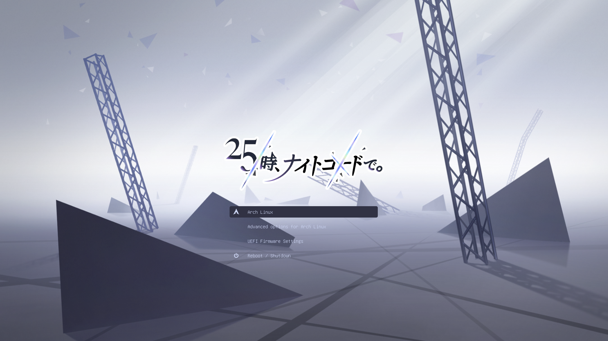

<h3 align="center">
  

  _25-ji, Nightcord de._ for [Grub](https://www.gnu.org/software/grub/)

</h3>

<a name="preview"></a>

## <a href="#preview"></a> Preview



<a name="installation"></a>

## <a href="#installation"></a> Installation

1. Clone the repository:

    ```shell
    git clone https://github.com/Cnily03/grub-25-ji.git && cd grub-25-ji
    ```

2. Repalce according to your resolution (optional):

    The default theme is best suited for a resolution of **1920x1080**. for other resolutions, you can copy files from [patches/](patches/) directory:

    ```shell
    sudo cp -r patches/<resolution>/* theme-25-ji/
    ```

3. Copy the theme:

    ```shell
    sudo cp -r theme-25-ji /usr/share/grub/themes/
    ```

    Some may be `/boot/grub/themes/`.

4. Uncomment and edit following line in `/etc/default/grub` to your selected theme:

    ```shell
    GRUB_THEME="/usr/share/grub/themes/theme-25-ji/theme.txt"
    ```

    According to where you put theme files.

<a name="step-update-grub"></a>

5. Update grub:

    ```shell
    sudo grub-mkconfig -o /boot/grub/grub.cfg
    ```

    For Fedora based distro:

    ```shell
    sudo grub2-mkconfig -o /boot/grub2/grub.cfg
    ```

<a name="grub-configuration"></a>

## <a href="#grub-configuration"></a> Grub configuration

Comment or uncomment to fit the following configuration in `/etc/default/grub`:

```conf
GRUB_DISABLE_OS_PROBER=false
# GRUB_TERMINAL_OUTPUT="console"
```

If you use theme different from your screen resolution, it's best to set `GRUB_GFXMODE` in `/etc/default/grub`. For example:

```conf
GRUB_GFXMODE=1920x1080
```

Remember to update grub after any modification _(see [STEP 5](#step-update-grub) in Section [Installation](#installation))_.

<a name="thanks-references"></a>

## <a href="#thanks-references"></a> Thanks & References

- [catppuccin/grub](https://github.com/catppuccin/grub)
- [vinceliuice/grub2-themes](https://github.com/vinceliuice/grub2-themes)

<div align="center">

<a name="copyright"></a>

<p align="center">
<a href="#copyright"></a>
</p>

<p align="center">

Copyright (c) [Cnily03](https://github.com/Cnily03)

<a href="./LICENSE"></a>

</p>

_Credits of some of the materials go to its rightful owner, including but not limited to [SEGA](https://www.sega.com/), [Colorful Palette](https://colorfulpalette.co.jp/) and [Crypton](https://www.crypton.co.jp/)._

</div>
